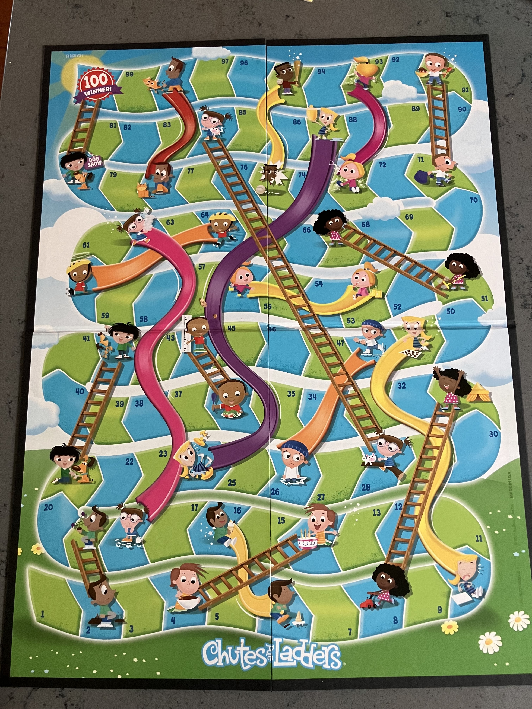
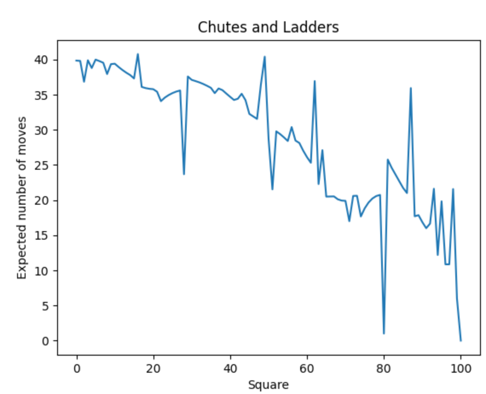
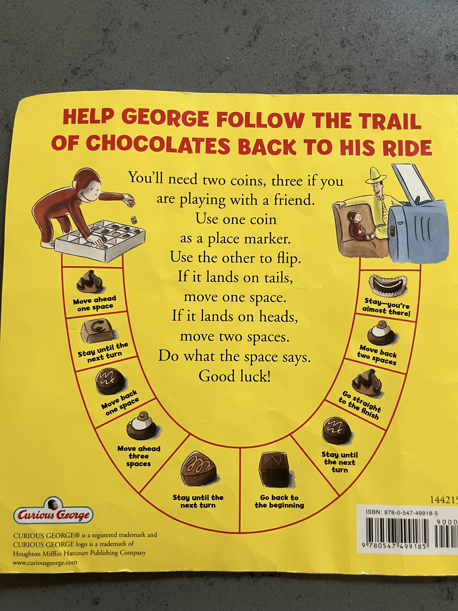
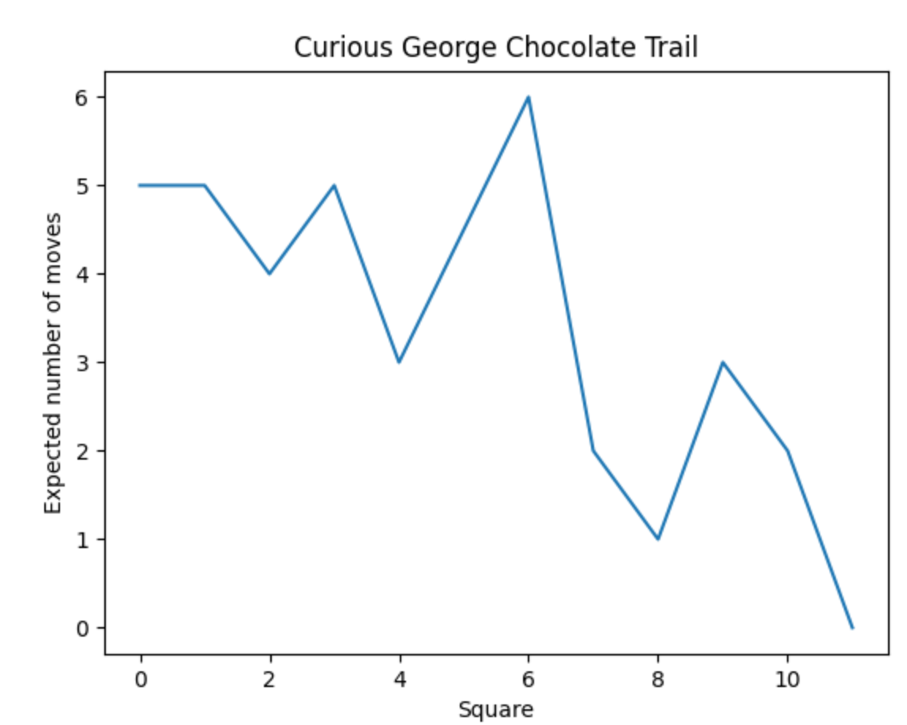

# Chutes and Ladders

Chutes and Ladders is a children's game of pure luck. It has 100 squares and a spinner ranging from 1 to 6.
Players start off board and take turns spinning the spinner.
Depending on the square landed on, the player will remain on the square, move forward if at the bottom of a ladder, or move backward if at the top of a chute.
The winner of the game is the first player to reach the last square. Overshooting the last square results in the player staying on their current square.

The game is exactly modeled as an absorbing Markov chain, since from any square the odds of moving to any other square are fixed and independent of previous moves.
The game begins on square 0, representing the off-board state.
The final square is an absorbing state; once a player reaches it, they cannot leave.

This repository uses the properties of Markov chains to calculate various statistics of the game with one player.
* Expected number of moves to finish the game (39.8593 moves from square 0)
* Probability of finishing the game by a given number of moves (33 is the median)
* Variance of the number of moves to finish the game (674 moves from square 0)
* Minimum number of moves to finish the game (6 moves)

This graph shows the expected number of moves to finish the game when starting on each square. If the starting square is at the bottom of a ladder or top of a chute, then there is only one next possible move: take the ladder or chute.   

# Curious George

On the back cover of the children's story *Curious George Goes to the Chocolate Factory*, is another such Markov chain game, but with 11 squares and a coin toss mapping to 1 or 2 squares forward.

Here is its graph of the expected number of moves.

### References
* https://en.wikipedia.org/wiki/Absorbing_Markov_chain
* https://math.uchicago.edu/~may/REU2014/REUPapers/Hochman.pdf
* https://possiblywrong.wordpress.com/2015/02/20/analysis-of-chutes-and-ladders/
